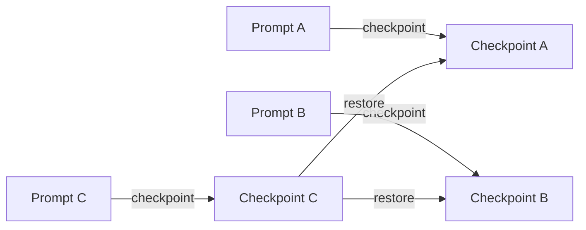

# 10. Checkpoints & Rewinding

## 10.1 Miten checkpoint toimii?

!!! abstract "Määritelmä"

    **Checkpoint** on tallennettu istunnon tila, joka sallii paluun aikaisempaan pisteeseen.

Claude Code seuraa omiä file-edit -työkalujensa tekemiä muutoksia ja luo checkpointit ennen
jokaisen muutoksen tekemistä. **Jokainen käyttäjän prompt luo checkpointin**, ja
checkpointit **säilyvät istunnon ymmärtävän**.

## 10.2 `/rewind`

!!! example

    `/rewind` on virallinen komento, ja `Esc` kaksi kertaa avaa rewind-valikon.

Valinnat:

- Restore code and conversation
- Restore conversation only
- Restore code only
- Summary

### Esimerkki 26: Rikkinäinen build

Claude tekee refaktoroinnin, testit hajoavat, etkä halua korjata ennen kuin näet lähtötilan.
Avaa `/rewind` ja palauta sekä koodi että keskustelu ennen riskialtista promptia.

### Esimerkki 27: Säilytä koodi, uudista keskustelu

Jos haluat säilyttää nykyiset muutokset mutta aloittaa ajattelupolun uudelleen, käytä
**Restore conversation** -vaihtoehtoa.

### Esimerkki 28: Palauta vain koodi

Jos Claude teki väärän tiedostomuutoksen mutta haluat pitää keskustelun päätökset näkyvillä,
käytä **Restore code** -vaihtoehtoa.

!!! warning "VAROITUS 12"
    Rewind ei palauta ulkoisia järjestelmävaikutuksia kuten jo ajettua deployta, tietokantamuutosta
    tai kolmannen osapuolen API-kutsua. Korkean vaikutuksen toimet pitää suunnitella erillaisilla
    **hyväksyntä- ja rollback-strategioilla**.

!!! tip "ADVANCED-VINKKI 11"
    Pidä aina **Git-commitit** palautuspistteinä suurissa refaktoroinneissa, vaikka Claude
    tarjoaa checkpointit. Paras malli on kaksitasoinen turva: **Claude checkpoint + Git commit + testit**.

---

## Seuraavaksi

- [Luku 11: Parhaat käytännöt](../parhaat-käytännit/12-periaatetta.md)
