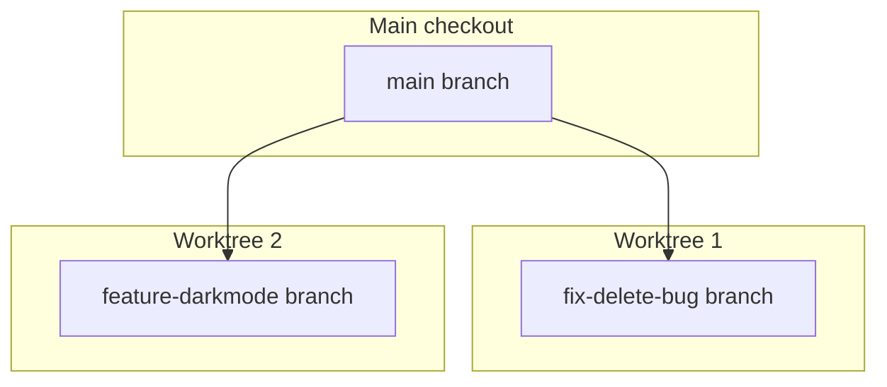

# 8. Git Worktrees

## 8.1 Miksi worktree on tärkeä?

!!! abstract "Määritelmä"

    **Git worktree** on erillinen työskentelyhakemisto ja branch, joka **jakaa saman
    repository-historian**.

Kun jokainen rinnakkainen Claude-istunto käyttää omaa worktreea, yhden agentin tiedostomuutokset
eivät koske toisen agentin checkoutia.



## 8.2 Luominen

```bash
claude --worktree bugfix-login
claude --worktree feature-darkmode
```

Git-näkymä:

```
git worktree list
```

Claude Code luo oletuksena:

- Worktreen polkina: `.claude/worktrees/<value>/`
- Uutena branchina: `worktree-<value>`

Worktreejen sijaintia voidaan muuttaa `WorktreeCreate`-hookilla.

## 8.3 .worktreeinclude

`.worktreeinclude` voi kopioida gitignoreen kuuluvia tiedostoja worktreeihin:

```
# .worktreeinclude
.env
.env.local
config/secrets.json
```

Tämä koskee **vain gitignored-tiedostoja** — **tracked-tiedostoja ei kopioida**.

### Esimerkki 20: Bugfix + feature rinnakkain

```bash
# Avaa kaksi terminaalia
# 1. terminaali:
claude --worktree fix-delete-bug

# 2. terminaali:
claude --worktree feature-dark-mode
```

Kumpikin työskentelee omassa checkoutissaan — eikä yksikään muutos vaikuta toiseen.

### Esimerkki 21: Agentin worktree-eristys

Custom subagentissa voi käyttää:

```yaml
---
name: isolated-worker
isolation: worktree
---
```

Tämän avulla agentti saa oman tilapäisen worktreen.

### Esimerkki 22: Worktreejen yhdistäminen

Kun rinnakkaiset tehtävät on validoitu:

```bash
git diff          # tarkista muutokset
git test          # testaa jokainen branch
git merge         # yhdi vasta sen jälkeen
```

!!! warning "VAROITUS 09"
    Worktree ei taata riippuvuuksien täydellistä erottelua. Jokaisessa uudessa worktreessä
    pitää tarvittaessa alustaa virtualenv, node_modules, build-cache tai muut
    ympäristökohtaiset artefaktit.

!!! warning "VAROITUS 10"
    Älä kopioi `.env`-tiedostoja `.worktreeinclude`-mekanismilla huolettomasti. Se on
    kätevää, mutta tekee jokaisesta worktreestä paikan, jossa salaisuus on käytettävissä.

---

## Seuraavaksi

- [Luku 9: Headless Mode](../headless-mode/index.md)
