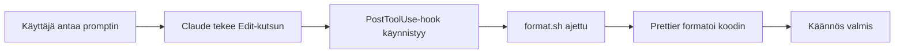

# Harjoitus 11: Formatoinnin automaatio hookilla

!!! quote "Tavoite"
    Konfiguroida **PostToolUse-hook**, joka automaattisesti **formatoi koodin**,
    kun Claude muuttaa JavaScript/TS/Python-tiedostoja.

## Taustaa

Hookit ovat **deterministisiä** — ne suoritetaan aina kun tietyt ehdot täyttyvät.
Tämä tarkoittaa, että voit varata: "Kun tiedosto muuttuu, aja formatointi."

Tärkeät hook-tapahtumat:

| Tapahtuma | Kuvaus |
|----------|--------|
| `PreToolUse` | Ennen työkalua — voi estää toiminnon |
| `PostToolUse` | Onnistunut työkalu — voi aja format, testi |
| `PostToolUseFailure` | Työkalu epäonnistui — recovery, telemetria |

## Tehtävä

Luo hook, joka:

✅ Kuuntelee `Edit`, `Write`, `NotebookEdit`-työkaluja  
✅ Aja `format.sh`-skripti onnistuneen muokkauksen jälkeen  
✅ Konfiguroi `.claude/settings.json`-ssä

## Ratkaisu

### 1. Skripti: `.claude/hooks/format.sh`

```bash
#!/usr/bin/env bash
# Automaattinen koodin formatointi
npx prettier --write src/**/*.{js,ts,jsx,tsx} 2>/dev/null || true
```

### 2. Konfiguurointi: `.claude/settings.json`

```json
{
  "hooks": {
    "PostToolUse": [
      {
        "matcher": "Edit|Write|NotebookEdit",
        "hooks": [
          {
            "type": "command",
            "command": ".claude/hooks/format.sh"
          }
        ]
      }
    ]
  }
}
```

### Miten se toimii?



### Esimerkki 11: Formatoinnin automaatio

Kun Claude muuttaa JS/TS/Python-tiedostoa, PostToolUse voi käynnistää formatoinnin.
Videossa käytetty sama malli **Prettierin** kanssa.

!!! warning "VAROITUS 05"
    Hookit ajetaan automaattisesti ja voivat itse sisältää vahvoja oikeuksia.
    Versionoikaa hookit, tarkastelkaa ne ja testatkaa erikseen ennen käyttöönottoa.

---

*Lähde: Esimerkki 11 [S1], [S11]*
