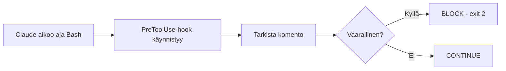

# Harjoitus 12: Estä vaaralliset Bash-komennot

!!! quote "Tavoite"
    Luoda **PreToolUse-hook**, joka estää vaaralliset komennot
    kuten `rm -rf /`, `git reset --hard`, `git push --force`.

## Taustaa

**PreToolUse** on tärkein turvallisuusmekanismi, koska se:

- On **ennen kuin komento suoritetaan**
- Voi palauttaa **"block"- päätöksen**
- Estää itseään shell-komennon suorittamista

Tämän mekanismin avulla voit estää:

- Tiedostojen poistamisen tärkeistä hakemistoista
- Versionhallinnan historician pöytzauksen
- Force-pushin ja force-resetin

## Tehtävä

Luo hook, joka estää seuraavat komennot:

| Komento | Miksi vaarallinen |
|---------|-------------------|
| `rm -rf /` | Poistaa koko tiedostopoljeron |
| `git reset --hard` | Pöllyttää kaikki paikalliset muutokset |
| `git push --force` | Ylikirjoittaa etähaaran historian |
| `shutdown` / `reboot` | Käynnistää uudelleen järjestelmän |

## Ratkaisu

### Hook-skripti: `.claude/hooks/block-dangerous.py`

```python
#!/usr/bin/env python3
import json, sys

data = json.load(sys.stdin)
cmd = data.get("tool_input", {}).get("command", "")

# Lista kielletyistä osioista
forbidden_patterns = [
    "rm -rf /",           # ei koskaan poista /
    "git reset --hard",   # estä historiikan pöytzays
    "git push --force",   # estä remote-overwrite
    "shutdown",           # estä järjestökäynnistys
    "reboot",             # sama juttu
    "chmod 777",          # liiallista oikeuksia
    ":(){:|:&};:",        # fork bomb
]

for pattern in forbidden_patterns:
    if pattern in cmd:
        print(json.dumps({
            "decision": "block",
            "reason": f"Dangerous command blocked by policy: {pattern}"
        }))
        sys.exit(2)

sys.exit(0)
```

### Konfiguurointi: `.claude/settings.json`

```json
{
  "hooks": {
    "PreToolUse": [
      {
        "matcher": "Bash",
        "hooks": [
          {
            "type": "command",
            "command": "python .claude/hooks/block-dangerous.py"
          }
        ]
      }
    ]
  }
}
```

### Miten se toimii?



Esimerkiksi:

```bash
$ rm -rf /home/user/project
❌ BLOCKED: Dangerous command blocked by policy: rm -rf /
```

!!! tip "ADVANCED-VINKKI 06"
    Käytä hookia **deterministiseen sääntöön**, ei sellaiseen päätökseen jossa mallin
    tulee ymmärtää abstraktia liiketoimintakontekstia.

---

*Lähde: Esimerkki 12 [S1], [S11]*
