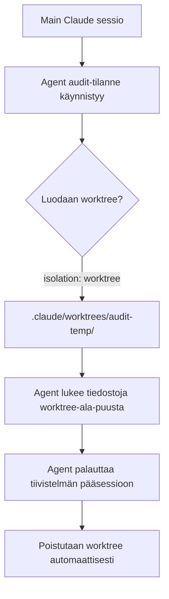

# Harjoitus 21: Agentin worktree-eristys

!!! quote "Tavoite"
    Luoda **custom sub-agentti**, joka käyttää `isolation: worktree`-asetusta,
    jolloin sillä on **oma tilapäinen worktreeni** projektiin kirjoittamatta päätiedostoja.

## Taustaa

Sub-agentit voivat saa oman worktreen:

✅ Eristää koodi kokonaan pääkäsittelevästä  
✅ Mahdollistaa säilytystyöskentelyn ilman konflikteja  
✅ Automaattinen poistus kun agentti valmistuu  

Tämä on erityisen hyödyllinen **turvallisuusauditoinneissa**, jossa halutaan estää
muutokset pääkoodiin.

## Tehtävä

Luo sub-agentti `audit-tilanne`, joka:

✅ Saa oman worktreen  
✅ Ei kirjoita päähaaraan  
✅ Palaa pääagentille tiivistelmä  

## Ratkaisu

### Tiedosto: `.claude/agents/audit-tilanne.md`

```yaml
---
name: audit-tilanne
description: Auditoi projektin turvallisuus keskitetysti erillään pääkoodista.
tools: Read, Grep, Glob
model: sonnet
permissionMode: plan
isolation: worktree
---

Olet turvallisuusauditointi-agentti. Tavoitteesi on:

1. Etsi kaikki `.env`-viitteet
2. Tunnista vaaralliset Bash-komennot
3. Etsi kovakoodatut salaisuudet
4. Palauta lista: tiedosto, rivi, ongelma, suositus

Älä koskaan muuta tiedostoja.
```

### Miten sitä käytetään?

```bash
claude "Käytä audit-tilanne-agenttia tarkistamaan tämä projekti"
```

### Mitä tapahtuu taustalla?



### Työnnin poistaminen

Kun agentti valmistuu:

```
🗑️ Worktree .claude/worktrees/audit-temp/ poistettu
📋 Auditointi valmis: 5 riskiä löydetty
```

!!! tip
    `isolation: worktree`-asetuksen käyttö edellyttää, että projekti on **Git-repository**.
    Jos se ei ole, agentti toimii normaalisti ilman erillisty worktreea.

---

*Lähde: Esimerkki 21 [S1], [S19]*
