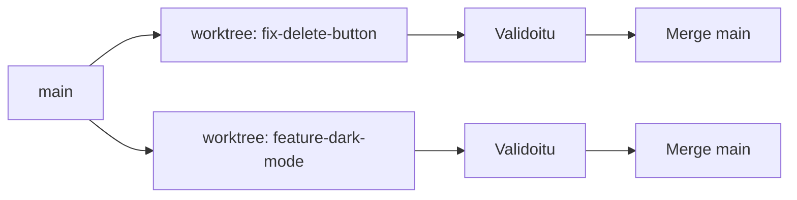

# Harjoitus 22: Worktreejen yhdistäminen

!!! quote "Tavoite"
    Opi **validaatiomaan** ja **yhdistämään** erilliset worktreet turvallisesti,
    ennen kuin koodi päätyy `main`-haaraan.

## Taustaa

Kun olet tehnyt työmää eri worktreissa:

✅ Sinun on **testattu** jokainen muutos erikseen  
✅ Sinun on **tarkistettava** että diff on oikea  
✅ Mergeä vasta kun kaikki on hyväksytty  

Tämä tarkoittaa usein myös:

1. **Checkata** kaikki työkalu-tulokset
2. **Aja testit** jokaisessa worktreessä
3. **Merge** vasta kun kaikki on vihreänä

## Tehtävä

Sinulla on kaksi valmista worktreetta:

- `fix-delete-button` — korjaa delete-painikkeen käyttäytymisen
- `feature-dark-mode` — lisää dark mode -tuen

Miten yhdistät ne turvallisesti?

## Ratkaisu

### Vaihe 1: Siirry ensimmäiseen worktreeon

```bash
cd .claude/worktrees/fix-delete-button
```

### Vaihe 2: Tarkista diff

```bash
git diff main
```

Tuloste:

```
diff --git a/src/components/Button.jsx b/src/components/Button.jsx
index abc..def 100644
--- a/src/components/Button.jsx
+++ b/src/components/Button.jsx
@@ -24,7 +24,7 @@
-  onClick={this.handleDelete}
+  onClick={event => {
+    event.stopPropagation();
+    this.handleDelete();
+  }}
```

### Vaihe 3: Aja testit

```bash
npm test
```

### Vaihe 4: Pushaa ja merge

```bash
git add .
git commit -m "Fix: Stop event bubbling on delete button"
git push origin fix-delete-button
```

Sen jälkeen avaa PR GitHubissa tai paikallisesti:

```bash
git checkout main
git pull
git merge fix-delete-button
git branch -d fix-delete-button  # poista haaran paikallisesti
```

### Vaihe 5: Toista toiselle worktreelle

Toista sama prosessi `feature-dark-mode`-worktreeille.

### Miten päähalmittäminen toimii?



!!! warning "Tärkeitä huomioita"
    - **Merge** aina vasta kun **kaikki testit ovat vihreänä**
    - Käytä **review-gatea** (sub-agentti) ennen mergeä
    - Älä koskaan mergeä suoraan production-haaraan ilman hyväksyntää

---

*Lähde: Esimerkki 22 [S1], [S19]*
