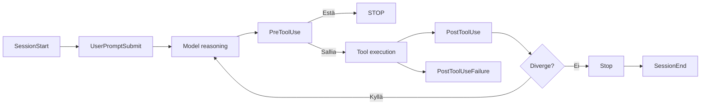

# 5. Hooks

## 5.1 Mikä Hook on?

!!! abstract "Määritelmä"

    **Hook** on Claude Coden elinkaaren tapahtumaan kytketty **automaatio**.

Hook voi olla:

- **shell-komento**
- **HTTP-pyyntö**
- **prompt-pohjainen arvio**
- **agent-pohjainen tarkistin**

MCP-työkaluilla on oma hook-tyyppinsä: `mcp_tool`.

### Handler-tyypit

| Tyyppi | Kuvaus |
|--------|--------|
| `command` | Suorittaa shell-komennon |
| `prompt` | Käyttää prompt-mallia |
| `agent` | Käynnistää agentin |
| `http` | Lähettää HTTP-pyynnön |
| `mcp_tool` | Kutsuu MCP työkalua |

## 5.2 Kaikki nykyisen hook-referenssin tapahtumat

| Tapahtuma | Milloin | Tyypillinen käyttö |
|----------|---------|-------------------|
| `SessionStart` | Uusi tai jatkoistettu sessio | Dynaaminen konteksti, ympäristö |
| `Setup` | CLI-init/maintenance | Kertaluonteinen valmistelu |
| `UserPromptSubmit` | Prompt lähetetään | Lisäkonteksti, auditointi |
| `UserPromptExpansion` | Komennon laajennus | Estä vaarallinen laajennus |
| `PreToolUse` | Ennen työkalua | Estä/validoi |
| `PermissionRequest` | Permission-dialogi | Custom approval flow |
| `PermissionDenied` | Työkalu evätty | Ohjaa retryyn tai lokiin |
| `PostToolUse` | Onnistunut työkalu | Format, audit, testi |
| `PostToolUseFailure` | Työkalu epäonnistui | Recovery, telemetria |
| `PostToolBatch` | Työkalupaketin valmistuttua | Erityistarkistus |
| `SubagentStart` | Subagent käynnistyy | Seuranta |
| `SubagentStop` | Subagent päättyy | Tulosten keruu |
| `Stop` | Agentti pysähtyy | Validaattori, lopullinen tarkistus |
| `StopFailure` | Stop epäonnistuu | Recovery |
| `PreCompact` | Ennen tiivistystä | Snapshot, kontekstin säilytys |
| `PostCompact` | Tiivityksen jälkeen | Kriittisen kontekstin palautus |
| `SessionEnd` | Sessio päättyy | Siivous |
| `Notification` | Tapahtuman ilmoitus | Slack, telemetria |
| `ConfigChange` | Asetukset muuttuvat | Auditointi / reload |
| `CwdChanged` | Työkansio vaihtuu | Kontekstin päivitys |
| `FileChanged` | Tiedosto muuttuu | Reaktiot |
| `InstructionsLoaded` | Ohjeet latautuvat | Observabiliteetti |
| `Elicitation` | MCP pyytää syötettä | Kontrolli |
| `ElicitationResult` | Elicitation valmistuu | Auditointi |
| `WorktreeCreate` | Worktree luodaan | Provisionointi |
| `WorktreeRemove` | Worktree poistetaan | Siivous |
| `TaskCreated` | Background task luodaan | Orkesterointi |
| `TaskCompleted` | Task valmistuu | Koonti |

!!! note "Huomio"
    Tapahtumapinta kehittyy nopeasti. Tarkasta aina oman version hook-reference ennen konfigurointia.

## 5.3 Hookien elinkaari



## 5.4 PreToolUse / PostToolUse -konfigurointi

### .claude/hooks/ -kansion asettelu

Hookit konfiguroidaan `.hooks`- tai `.claude/hooks/`-kansioon. Tärkein
konfigurointitapa on `.claude/settings.json`:

```json
{
  "hooks": {
    "PreToolUse": [
      {
        "matcher": "Edit|Write",
        "hooks": [
          {
            "type": "command",
            "command": "./.claude/hooks/protect-files.sh"
          }
        ]
      }
    ],
    "PostToolUse": [
      {
        "matcher": "Edit|Write",
        "hooks": [
          {
            "type": "command",
            "command": "python ./.claude/hooks/format.py"
          }
        ]
      }
    ]
  }
}
```

### Esimerkki 11: Formatoinnin automaatio

```json
{
  "hooks": {
    "PostToolUse": [
      {
        "matcher": "Edit|Write|NotebookEdit",
        "hooks": [
          {
            "type": "command",
            "command": ".claude/hooks/format.sh"
          }
        ]
      }
    ]
  }
}
```

### Esimerkki 12: Estä vaaralliset Bash-komennot

```python
#!/usr/bin/env python3
import json, sys

data = json.load(sys.stdin)
cmd = data.get("tool_input", {}).get("command", "")
forbidden = ["rm -rf /", "git reset --hard", "git push --force"]
if any(x in cmd for x in forbidden):
    print(json.dumps({"decision": "block", "reason": "Dangerous command blocked by policy"}))
    sys.exit(2)
sys.exit(0)
```

!!! warning "VAROITUS 05"
    Hookit ajetaan automaattisesti ja voivat itse sisältää vahvoja oikeuksia.
    Versionoi hookit, tarkastele ne ja testaa erikseen ennen käyttöönottoa.

!!! warning "VAROITUS 06"
    Kaikki hookit eivät tue kaikkia handler-typpejä. Tarkista tapahtumakohtainen tuki ennen konfigurointia.

---

## Seuraavaksi

- [Luku 6: MCP Servers](../mcp/index.md)
- [Harjoitus 11: Formatoinnin hook](../harjoitukset/11-formatointi-hook.md)
