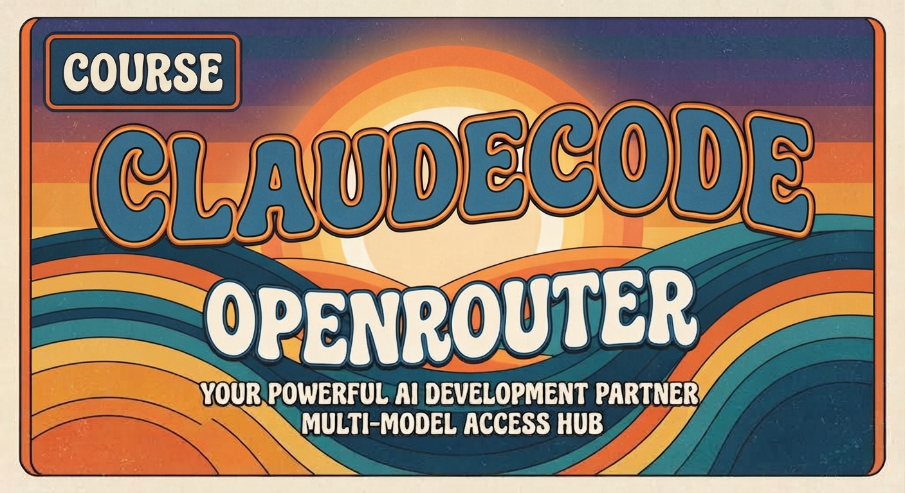

   

# Claude Code - Pieni käytäntö opas agenttiseen kehitykseen

Claude Code ‑opas on suunniteltu sekä aloittelijoille että kokeneille kehittäjille, jotka haluavat hallita agenttipohjaisen kehitysympäristön kokonaisuutena. Kyse ei ole pelkästä perusteista, vaan käytännönläheisestä ja projektivetoisesta oppaasta, joka näyttää, miten Claude Codea hyödynnetään tehokkaasti todellisissa kehitysskenaarioissa.

Mukana on myös selkeä ja konkreettinen ohje OpenRouter‑rajapinnan käyttämiseen MML‑mallien kanssa — suora väylä, jonka kautta saat päivittäin jopa 50 API‑kutsua eri malleille täysin ilmaiseksi (tai jopa 1000 kutsua noin 13 dollarilla). OpenRouter tarjoaa lisäksi täysin ilmaisia LLM‑malleja, joiden avulla voit kokeilla, testata ja rakentaa ilman kustannuspaineita. Tämä tekee oppaasta erinomaisen työkalun kaikille, jotka haluavat kehittää ja iteratiivisesti testata agenttiratkaisuja nopeasti ja kustannustehokkaasti.

Opas syntyi omista muistiinpanoistani ja käytännön kokeiluista. Toivon, että se tarjoaa sinulle yhtä paljon oivalluksia ja hyötyä kuin minulle sen kokoamisen aikana. 

## Mitä tässä oppaassa opit?

Tämä opas tarkastelee Claude Codea **kehitysympäristönä** — ei pelkkänä chat-käyttöliittymänä. Keskeinen ajatus on, että Claudea voidaan ohjata **kontekstilla**, **säännöillä**, **erikoisagenteilla**, **toistettavilla prosesseilla**, **deterministisillä hookeilla** ja **ulkoisilla MCP-työkaluilla**.

Tavoitteena on saada enemmän automaatiota ilman, että turvallisuus, jäljitettävyys tai hallittavuus kärsivät.

## Sivuston rakenne

| Osa | Kuvaus |
|-----|--------|
| **Teknologian perusteet** | Lyhyt johdanto sekä aloittelijalle että edistuneemmalle käyttäjälle |
| **Luvut 1–13** | Claude Code edistynyt käyttö opiskelumeteriaalit |
| **Liitteet A–D** | Komennot, projektirakenne, lähteet ja käytännön esimerkit |
| **Harjoitukset** | 35 itsenäistä harjoitusta ratkaisuilla |

## Aloita tästä

Valitse alla olevista linkeistä:

!!! tip "Aloittelijat"
    Aloita [Teknologian perusteet → Aloittelijalle](teknologian-perusteet/aloitus.md),
    jossa selvitetään mitä Claude Code pystyy ja miksi se eroaa tavallisesta ChatGPT:stä.

!!! advanced "Edistyneet käyttäjät"
    Siirry suoraan [Luku 2: Arkkitehtuuri ja periaatteet](arkkitehtuuri/arkkitehtuuri.md),
    jossa tarkastellaan kerrosmallia ja permission engine -periaatteita.

---

<em>Tarkista aina
 versiopoikkeavuudet omasta versiosi <code>claude --help</code> -komennolla.</em>

