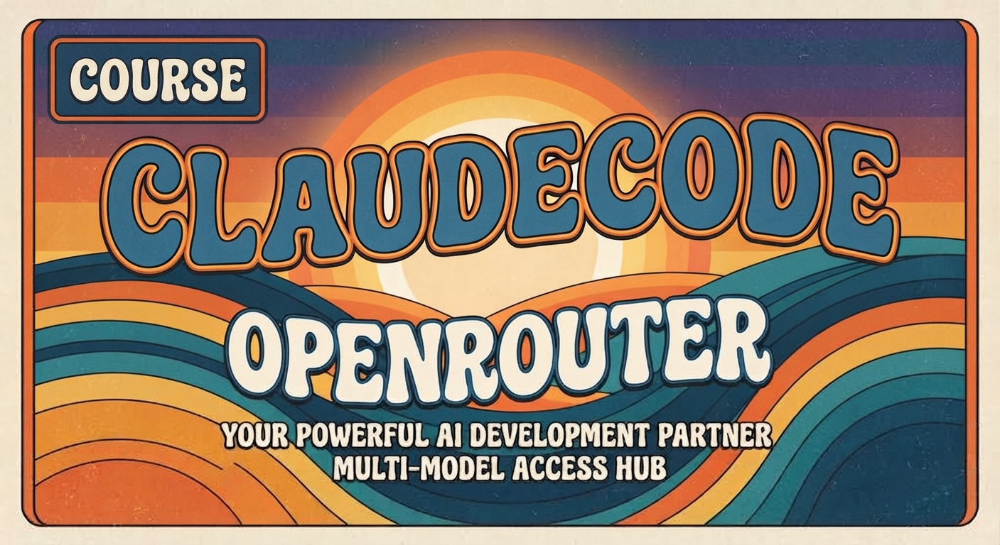

   

# Claude Code: Opas agenttiseen kehitykseen

Tämä opas syntyi oman Claude Code ‑opiskeluni ohessa, muistiinpanoista ja käytännön kokeiluista. Toivon, että se tarjoaa sinulle yhtä paljon oivalluksia ja hyötyä kuin minulle sen kokoamisen aikana. Julkaisu on tällä hetkellä beta 1.0 ‑versio, joten sisältöä tarkennetaan ja kehitetään edelleen.

Mukana on myös ohje OpenRouter‑rajapinnan käyttämiseen MML‑mallien kanssa — suora väylä, jonka kautta saat päivittäin jopa 50 API‑kutsua eri malleille täysin ilmaiseksi (tai jopa 1000 kutsua noin 13 dollarilla). OpenRouter tarjoaa lisäksi täysin ilmaisia LLM‑malleja, joiden avulla voit kokeilla, testata ja rakentaa ilman kustannuspaineita.

## Mitä tässä oppaassa opit?

Tässä oppaassa tarkastellaan Claude Codea täysiverisenä kehitysympäristönä — ei pelkkänä chat‑ikkunana. Keskeinen ajatus on, että Claudea voidaan ohjata ja hallita kontekstilla, säännöillä, erikoisagenteilla, toistettavilla työprosesseilla, deterministisillä hookeilla sekä ulkoisilla MCP‑työkaluilla.

Opas näyttää, miten nämä elementit muodostavat yhdessä järjestelmällisen ja ennustettavan työskentelymallin, jossa kielimalli toimii kuin projektin sisäinen kehittäjä: lukee, analysoi, muokkaa, suorittaa ja automatisoi — hallitusti ja toistettavasti.

## Sivuston rakenne

| Osa | Kuvaus |
|-----|--------|
| **Teknologian perusteet** | Lyhyt johdanto tekoälyyn ja agenttiseen ohjelmistokehitykseen |
| **Opas: luvut 1–13** | Itse Claude Code opiskelumeteriaalit |
| **Liitteet A–D** | Komennot, esimerkkiprojektin rakenne, lähteet ja käytännön esimerkit|
| **Harjoitukset** | 35 itsenäistä harjoitusta ratkaisuilla |

## Aloita tästä

!!! tip "Suositeltu aloitusjärjestys"
    Aloita lukemalla [Johdanto](johdanto/mita-on-claude-code.md), jossa hahmotetaan Claude Coden perusidea ja sen ero tavallisiin chat‑malleihin.  
    Siirry sen jälkeen [Teknologian perusteisiin](teknologian-perusteet/aloitus.md), joissa avataan, miten Claude Code toimii kehitysympäristönä, mitä se osaa ja miksi sen agenttimalli mahdollistaa täysin erilaisen, toistettavan ja hallitun työskentelytavan verrattuna esimerkiksi ChatGPT:n selaimessa toimivaan käyttöliittymään.

---

<em>"Virheet ovat vain tekoälyn luovia ehdotuksia siitä, miten asiat voisi tehdä vaikeammin."</em>

