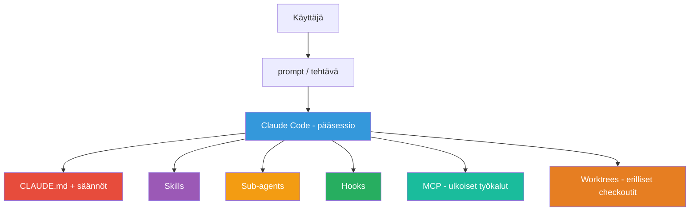

# 1.3 Claude Coden mielenmalli

## Arkkitehtuurinäkymä

Käyttäjä antaa **promptin tai tehtävän**. Tämä kulkee:

1. **CLAUDE.md + säännöt** → projekti- ja käyttäjäkonteksti
2. **Skills** → toistettavat työprosessit
3. **Sub-agents** → erillinen konteksti ja erikoistunut rooli
4. **Hooks** → deterministiset tarkistukset tapahtumiin
5. **MCP** → ulkoiset työkalut ja tietolähteet
6. **Worktrees** → fyysisesti eristetyt työskentelypuut

## Tärkein periaate

> **Kielimalli tekee päätöksiä todennäköisyysperusteisesti, mutta hookit, permissionsäännöt, Git ja CI voivat tehdä kriittisistä kohdista deterministisiä.**

Claude Code toimii parhaiten, kun nämä vastuut **erotellaan** toisistaan.

## Selitys

| Mekanismi | Miksi se on tärkeä? |
|-----------|---------------------|
| **CLAUDE.md** | Tarjoaa **pysyvän** kontekstin |
| **Skills** | Automatisoi **toistuvat työt** |
| **Sub-agents** | Jaa työ eri **konteksteihin** |
| **Hooks** | Tarjoaa **determinististä** tarkistusta |
| **MCP** | Avaa **ulkoiset tiedot** |
| **Worktrees** | Erottaa **fyysisesti** koodit |

---

*Lähde: [S2] Features Overview*
