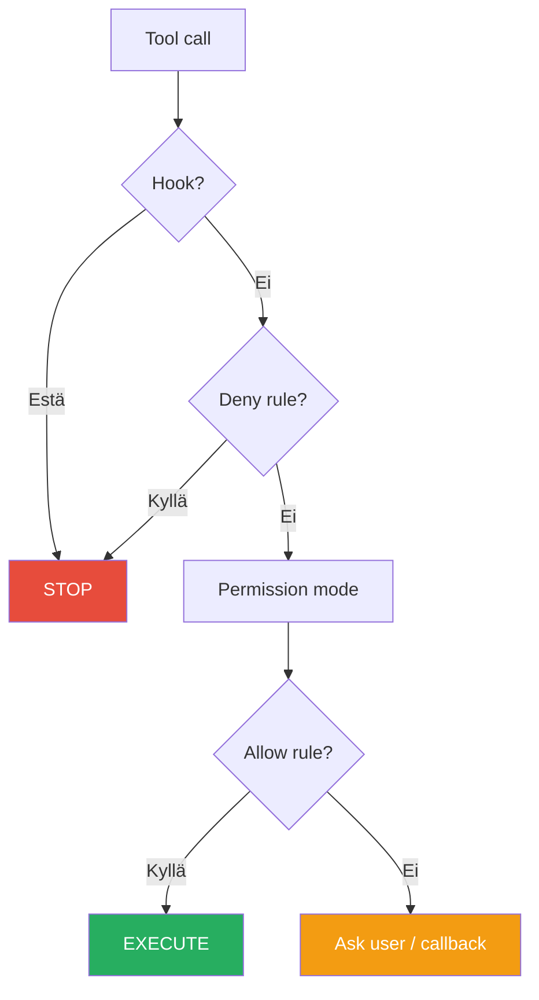

# 1.4 Permission Engine (Lupa-moottori)

## Kerrosmallinen lupajärjestelmä

Claudessa on permission-järjestelmä, jossa säännökset arvioidaan järjestyksessä:

**deny → ask → allow**

## Päätöspuu



## Permission moodit

| Moodi | Kuvaus | Käyttöesim |
|-------|--------|-------------|
| `default` | Kysyy joka kirjoitustoimenpiteessä | Normaalikehitys |
| `acceptEdits` | Hyväksyy tiedostomuutokset automaattisesti | Nopeampi kirjoittelu |
| `dontAsk` | Ei kysy mitään | Automatisoitu testaus |
| `plan` | Rajoittuu vain read-only -työkaluihin | Alkuanalyysi |
| `bypassPermissions` | Kaikki sallittu ilman kyselyä | Vain CI/testiympäristö |

!!! warning "VAROITUS 15"
    `bypassPermissions` antaa erittäin laajat oikeudet ja vaatii erityistä varovaisuutta.
    Käytä vain **kontrolloiduissa ympäristöissä**, joissa kaikki operaatiot ovat hyväksyttävissä.

## Esimerkkipäätöspuu

```
Tool call
  │
  ├─ Hook?          → Estä? → STOP
  │
  ├─ Deny rule?     → Kyllä? → STOP
  │
  ├─ Permission mode → tarkista (default / acceptEdits / dontAsk / plan / bypass)
  │
  └─ Allow rule?    → Kyllä? → EXECUTE
                    → Ei? → Interactive approval / callback
```

---

## Seuraavaksi

- [Luku 2: Arkkitehtuuri](../arkkitehtuuri/arkkitehtuuri.md)

---

*Lähde: [S2] Features Overview, [S10] Permissions*
