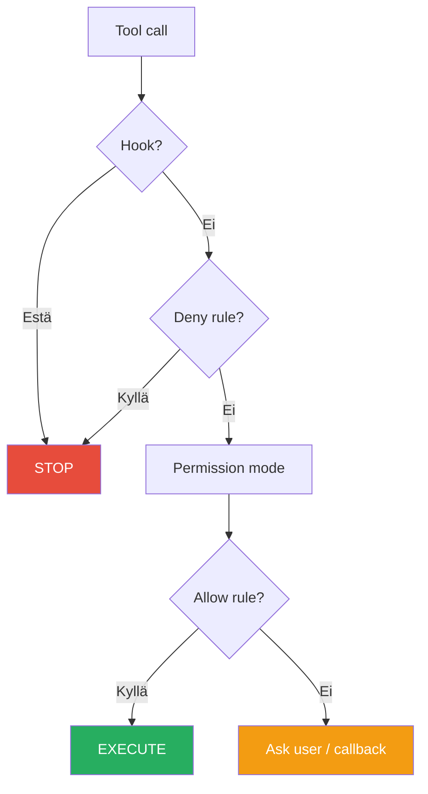

# 1.4 Permission Engine (Lupa-moottori)

### 1.4 Permission Engine (Lupa‑moottori)  
#### Kerrosmallinen lupajärjestelmä

Claude käyttää kerrosmallista lupajärjestelmää, jossa jokainen pyyntö (esim. tiedoston luku, API‑kutsu, komentojen suoritus) arvioidaan **kolmessa vaiheessa** selkeässä järjestyksessä:

1. **deny (estä)**  
   - Ensimmäisenä tarkistetaan, onko olemassa sääntö, joka **nimenomaisesti kieltää** toiminnon.  
   - Jos jokin sääntö sanoo “tätä ei saa tehdä”, pyyntö **pysäytetään heti**.  
   - Deny‑säännöt ovat vahvimpia: ne voittavat kaikki myöhemmät “ask”‑ ja “allow”‑säännöt.

2. **ask (kysy)**  
   - Jos mitään suoraa kieltoa ei ole, tarkistetaan, onko toiminto sellainen, että siitä pitää **kysyä erikseen lupa**.  
   - Tällöin järjestelmä ei tee mitään automaattisesti, vaan pyytää käyttäjältä tai konfiguraatiolta vahvistuksen:  
     - esim. “Sallitaanko pääsy tähän kansioon?”  
   - Ask‑kerros on kuin “varmistusvaihe”: se ei kiellä, mutta ei myöskään salli ilman tietoista päätöstä.

3. **allow (salli)**  
   - Jos pyyntöä ei ole kielletty (deny) eikä siitä tarvitse kysyä erikseen (ask), se siirtyy **allow‑kerrokseen**.  
   - Täällä tarkistetaan, onko toiminto **sallittu oletuksena** tai jonkin positiivisen säännön perusteella.  
   - Jos mikään ei estä eikä vaadi lisäkysymystä, toiminto **hyväksytään ja suoritetaan**.

#### Tärkeä periaate: järjestys ratkaisee

- **Ensin etsitään kieltoja (deny)** → jos löytyy, peli päättyy siihen.  
- **Vasta sitten kysytään (ask)** → jos sääntö vaatii vahvistusta, toiminto riippuu vastauksesta.  
- **Lopuksi sallitaan (allow)** → jos mikään ei estä eikä vaadi kysymistä, toiminto menee läpi.

Tämä kerrosmalli varmistaa, että:
- vaaralliset tai ei‑toivotut toiminnot pysäytetään heti (deny),
- epäselvissä tilanteissa käyttäjältä kysytään (ask),
- turvalliset ja arkiset toiminnot voivat tapahtua sujuvasti (allow).

---

#### Vertauskuva aloittelijalle

Ajattele Permission Engineä kuin **kerrostettua ovijärjestelmää toimistossa**:

- **Deny‑kerros = turvamies ovella**  
  Jos turvamies näkee, että sinulla ei ole kulkulupaa tai olet väärässä paikassa, hän sanoo heti:  
  > “Et voi mennä sisään.”  
  Edes esimies ei voi ohittaa tätä ilman, että sääntöjä muutetaan.

- **Ask‑kerros = vastaanotto / info**  
  Jos turvamies ei estä sinua, mutta olet menossa huoneeseen, johon pääsyä ei ole merkitty selvästi, vastaanotto kysyy:  
  > “Onko sinulla lupa mennä tähän neuvotteluhuoneeseen?”  
  Vasta kun joku vahvistaa, sinut päästetään sisään.

- **Allow‑kerros = avoin toimistotila**  
  Kun olet alueella, johon sinulla on kulkulupa, voit liikkua vapaasti:  
  > “Tähän avotilaan voit tulla ilman erillistä lupaa.”  

Claude toimii samalla logiikalla:  
ensin tarkistetaan, **onko tämä kielletty**, sitten **pitääkö tästä kysyä**, ja vasta lopuksi **sallitaanko tämä automaattisesti**.


## Päätöspuu



## Permission moodit

| Moodi | Kuvaus | Käyttöesim |
|-------|--------|-------------|
| `default` | Kysyy joka kirjoitustoimenpiteessä | Normaalikehitys |
| `acceptEdits` | Hyväksyy tiedostomuutokset automaattisesti | Nopeampi kirjoittelu |
| `dontAsk` | Ei kysy mitään | Automatisoitu testaus |
| `plan` | Rajoittuu vain read-only -työkaluihin | Alkuanalyysi |
| `bypassPermissions` | Kaikki sallittu ilman kyselyä | Vain CI/testiympäristö |

!!! warning "VAROITUS 15"
    `bypassPermissions` antaa erittäin laajat oikeudet ja vaatii erityistä varovaisuutta.
    Käytä vain **kontrolloiduissa ympäristöissä**, joissa kaikki operaatiot ovat hyväksyttävissä.

## Esimerkkipäätöspuu

```
Tool call
  │
  ├─ Hook?          → Estä? → STOP
  │
  ├─ Deny rule?     → Kyllä? → STOP
  │
  ├─ Permission mode → tarkista (default / acceptEdits / dontAsk / plan / bypass)
  │
  └─ Allow rule?    → Kyllä? → EXECUTE
                    → Ei? → Interactive approval / callback
```

---

## Seuraavaksi

- [Luku 2: Arkkitehtuuri](../arkkitehtuuri/arkkitehtuuri.md)

---

*Lähde: [S2] Features Overview, [S10] Permissions*
