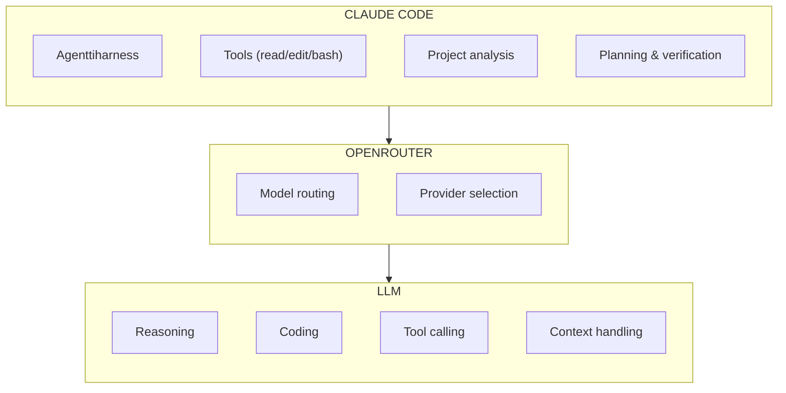

# LLM‑mallin valinta Claude Codessa

Tässä oppaassa Claude Codea käytetään **OpenRouterin kautta**, joka tarjoaa pääsyn useisiin eri LLM‑malleihin yhden rajapinnan kautta. Claude Code ei ole keskustelumalli, vaan **agenttiharnessi**, joka käyttää LLM:ää päätöksentekoon ja työkalujen ohjaamiseen.

Siksi mallin valinta ei ole sama asia kuin “paras chattimalli”, vaan kyse on siitä, miten hyvin malli toimii **agenttikäytössä**.

## Miksi tavallinen LLM‑vertailu ei riitä?

Perinteinen LLM‑vertailu keskittyy:

- päättelyyn  
- koodinlaatuun  
- kielitaitoon  
- konteksti‑ikkunaan  
- nopeuteen  

Agenttikäytössä tarvitaan lisäksi:

- **luotettava tool calling**  
- oikeamuotoiset JSON‑argumentit  
- virheistä palautuminen  
- monen tiedoston samanaikainen käsittely  
- suunnitelmallinen toiminta (ei suoraa “koodaa ja toivo parasta”)  
- oman työn verifiointi  
- pitkäjänteinen ohjeiden noudattaminen  

Nämä ominaisuudet erottavat **agenttimallit** tavallisista keskustelumalleista.

---

## Tool calling — tärkein yksittäinen vaatimus

Claude Code käyttää työkaluja jatkuvasti:

- tiedostojen lukeminen  
- tiedostojen muokkaaminen  
- komentojen suorittaminen  
- projektin rakenteen tutkiminen  

Siksi mallin täytyy tukea:

```
tools = YES
tool_choice = YES
structured_outputs = YES (hyödyllinen)
```

Ilman tool callingia malli ei voi toimia agenttina.

### Tool calling ‑tuki ei yksin riitä

Vaikka malli tukee tool callingia, se voi silti epäonnistua:

- se ei muodosta oikeaa JSON‑rakennetta  
- se ei noudata schemaa  
- se ei ymmärrä monivaiheista työkaluketjua  
- se ei verifioi omaa työtään  
- se ei osaa jatkaa virheestä  

Siksi mallin yhteensopivuus on **testattava käytännössä**.

---

## Mallin valinnan hierarkia (tiivistetty)

Claude Code arvioi mallin soveltuvuutta seuraavassa järjestyksessä:

```
1. API‑yhteensopivuus
2. Tool calling
3. Tool‑schema‑yhteensopivuus
4. Agenttikäyttäytyminen
5. Reasoning
6. Coding
7. Context‑ikkuna
8. Instruction following
9. Verification
10. Error recovery
11. Kielivaatimukset (esim. suomenkielinen dokumentointi)
12. Nopeus
13. Kustannus
14. Saatavuus / rate limits
```

Jos malli epäonnistuu kohdissa **1–3**, sitä ei voi käyttää agenttina.

---

## Mitä hyvältä agenttimallilta vaaditaan?

Hyvä agenttimalli pystyy suorittamaan koko toimintaketjun:

```
TASK → Explore → Understand → Plan → Modify → Verify → Report
```

Agentin ei pitäisi hypätä suoraan muokkaamaan tiedostoja, vaan sen tulee:

- tutkia projektia  
- ymmärtää rakenteen  
- suunnitella muutokset  
- toteuttaa ne työkaluilla  
- tarkistaa työnsä  
- raportoida selkeästi  

### Suuri konteksti + hyvä päättely + luotettava tool calling

```
Suuri konteksti  +  hyvä reasoning  +  luotettava tool calling  =  hyvä agentti
```

---

## Lopullinen tarkistuslista mallin valintaan

### Tool calling

```
[ ] tools
[ ] tool_choice
[ ] JSON Schema -yhteensopivuus
[ ] Oikeat argumentit työkaluille
[ ] Oikea tulosten käsittely
```

### Agenttikäyttäytyminen

```
[ ] Suunnittelee ennen toimintaa
[ ] Käyttää työkaluja oikein
[ ] Lukee ja muokkaa tiedostoja
[ ] Suorittaa komentoja hallitusti
[ ] Tekee multi-file-muutoksia
[ ] Palautuu virheistä
[ ] Verifioi oman työnsä
```

### Luotettavuus

```
[ ] Toistettavat tulokset
[ ] Ei jää silmukkaan
[ ] Ei tee turhia muutoksia
[ ] Ei keksi tiedostojen sisältöjä
[ ] Ei väitä tehneensä muutoksia joita ei tehnyt
```

---

## Claude Code + OpenRouter + LLM — kokonaisuus




