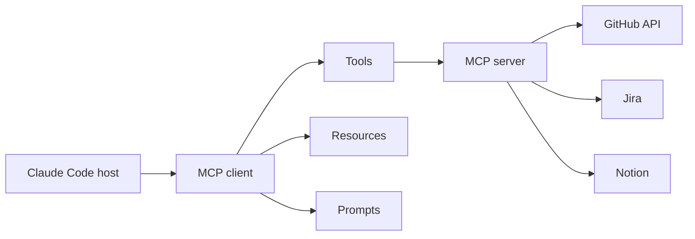

# 6. MCP Servers (Model Context Protocol)

## 6.1 Mikä MCP on?

!!! abstract "Määritelmä"

    **Model Context Protocol (MCP)** on avoin standardi, jonka avulla AI-sovellus
    yhdistyy ulkoisiin tietolähteisiin ja työkaluihin.

MCP määrittelee:

- `host/client/server` -mallin
- JSON-RPC 2.0 -viestit

Server voi tarjota:

- **Resurssit** (`resources`)
- **Promptit** (`prompts`)
- **Työkalut** (`tools`)



### Kolme keskeistä primitiiviä

| Primitive | Kontrolli | Esimerkki |
|----------|-----------|-----------|
| Tools | Model-controlled | Funktiot, jotka Claude kutsuu |
| Resources | Application-controlled | Tiedostot, tietokanta-taulut |
| Prompts | User-controlled | Valmiit promptit (templates) |

!!! warning "VAROITUS 07"
    MCP ei tee ulkoisesta järjestelmästä automaattisesti turvallista. Tool voi kutsua API:a,
    muuttaa dataa tai tehdä muita sivuvaikutuksia. Käytä **pienintä oikeutta mallia (least
    privilege)** ja **ihmisen hyväksyntää** korkeiden vaikutusten operaatioissa.

## 6.2 MCP:n asennus Claude Codeen

### HTTP-palvelin

```bash
claude mcp add --transport http notion https://mcp.notion.com/mcp

# Käynnistä Claude Code ja autentikoi
/mcp
```

Konfiguraatio voidaan tehdä myös CLI:llä tai `.mcp.json`- tai `~/.claude.json`-määritelyn avulla.

## 6.3 Granola MCP -esimerkki

```bash
claude mcp add granola --transport http https://mcp.granola.ai/mcp
```

!!! tip "ADVANCED-VINKKI 07"
    Rajoita MCP-palveluiden output-koko. Claude varoittaa suurista MCP-työkalutuloksista
    10 000 tokenin kohdalla, ja oletusmaksimi on 25 000 tokenia. Tämän `MAX_MCP_OUTPUT_TOKENS`
    -ympäristömuuttujan avulla.

### Esimerkki 14: MCP + issue tracker

Pyydä Claudea hakemaan JIRA-issuen, lukemaan vaatimukset ja tekemään toteutussuunnitelma
ilman, että issue-teksti kopioidaan chatiin:

```bash
claude mcp add --transport http jira https://example.invalid/mcp
```

### Esimerkki 15: MCP + observability

MCP-palvelin voi tarjota tuotantolokien tai incähytysten hakutyön. Claude voi yhdistää
lokis- ja lähdekohdat samaan diagnoosiin.

### Esimerkki 16: MCP + tietokanta (read-only)

```bash
# Luo MCP-palvelin, joka sallii vain SELECT-operaatiot
claude mcp add --transport http test-db read-only-mcp-server
```

---

## Seuraavaksi

- [Luku 7: Parallel Sessions](../parallel-sessions/index.md)
