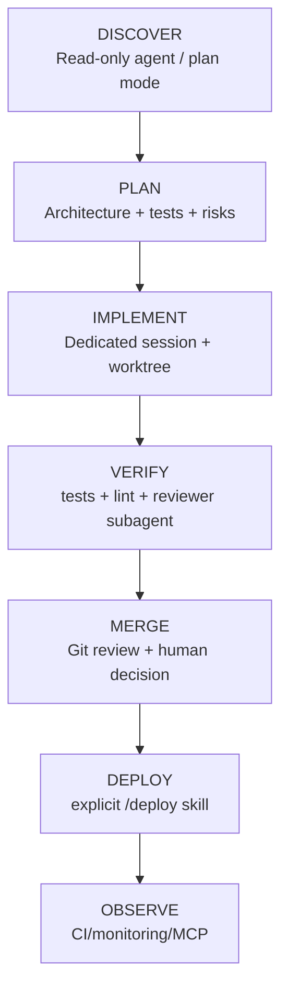

# 11. Parhaat käytännöt

## 11.1 12 periaatetta

!!! tip "Muista nämä 12 periaatetta!"

    1. **Anna Claude ymmärtää repository ensin** ennen kuin pyydät isoja muutoksia.
    2. **Piloita laaja työ selvästi nimettyihin vaiheisiin.**
    3. **Pidä `CLAUDE.md` tiiviinä**; siirrä pitkät workflowt **Skillsiin**.
    4. **Käytä subagentteja** sivutehtäviin, jotka kuluttavat paljon kontekstia.
    5. **Käytä worktreeja**, kun rinnakkainen tehtävä muuttaa samaa repoa.
    6. **Käytä hookia** deterministisiin turva- ja laatutarkistuksiin.
    7. **Rajaa MCP:n työkalut** vähimmän tarvittavaan.
    8. **Tee deploy/rollback** manuaalisesti laukaisevaksi **skilliksi**.
    9. **Headless-ajossa** pyri konekäsiteltävään **JSONiin** ja validointiin.
    10. **Pidä Git branch/commit** versionhallinnan totuuslähteenä.
    11. Kun konteksti kasvaa, käytä `/compact` tai jaa työ uusiin sessioihin.
    12. **Versioi Claude-konfiguraatio** samoin kuin tuotantokoodi.

## 11.2 Kehityspolku: discovery → plan → implement → verify

### Esimerkki 29: TDD Claude-työskentely

Pyydä agenttia ensin lisäämään **failing test**, sitten toteutus ja lopuksi testien ajo.
Tavoitteena on tehdä hyväksymiskriteeri koneellisesti tarkistettavaksi.

### Esimerkki 30: Definition of Done -skill

Luo `/done`-skill, joka tarkistaa:

- Testit
- Lint
- Muutetut tiedostot
- Dokumentaation tarkistus
- Git-diff

ennen PR:ää.

### Esimerkki 31: Review gate

Käytä **reviewer-subagenttia ennen mergeä**. Pääkeskustelu käyttää vain review-raportin yhteenvetoa, mikä säästää kontekstia.

### Esimerkki 32: Release pipeline

`/release 1.4.0` voi tehdä:

- Changelog
- Testit
- Version tagin ehdokkaan
- Release-notes-luonnos

Mutta **production deploy** jää ihmisen erikseen laukaisemaksi.

---

## Seuraavaksi

- [Luku 12: Turvallisuus ja riskienhallinta](../turvallisuus/index.md)
