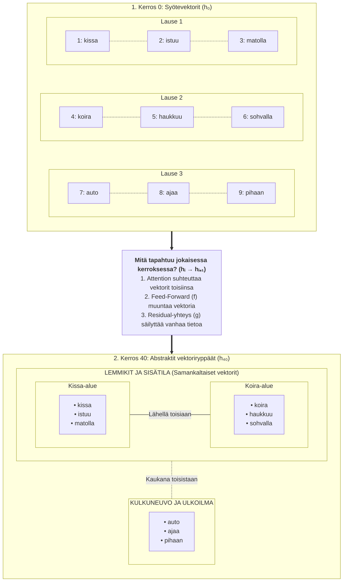
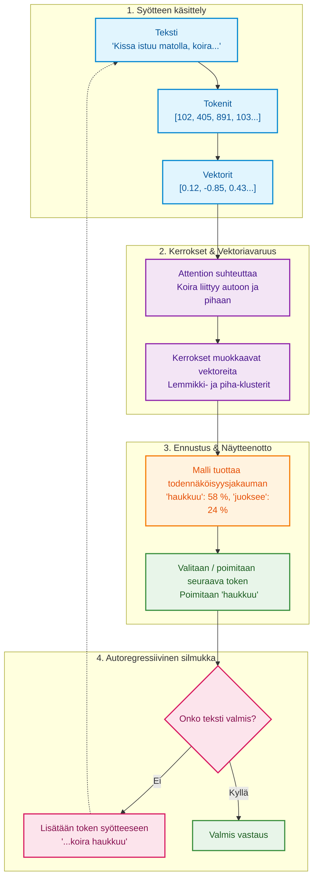

# Miten LLM toimii teknisesti?

Suuri kielimalli (LLM) ei "ymmärrä" tekstiä ihmisen tavoin. Sen toiminta perustuu matemaattiseen optimointiin, vektorilaskentaan ja todennäköisyysjakaumiin. 

Alla on tekninen, mutta aloittelijalle suunnattu läpikäynti siitä, mitä mallin sisällä tapahtuu. Tavoitteena ei ole opetella jokaista kaavaa ulkoa, vaan luoda selkeä ajatus ja intuitio siitä matemaattisesta konseptista, jolla teksti muuttuu numeroidun avaruuden kautta järkevältä kuullostavaksi kieleksi.

---

## 1. Tokenointi — teksti muutetaan numeroiksi

LLM ei käsittele sanoja, vaan **tokeneita**. Tokeni voi olla:

- sana  
- sanan osa  
- yksittäinen merkki  

Jokainen tokeni muutetaan **kokonaisluvuksi** (ID).  

Esimerkiksi:

| Teksti | Token | ID |
|--------|--------|----|
| "kissa" | "kis" | 15342 |
| "kissa" | "sa"  | 981 |

Mallin sisällä kaikki teksti on **numeroita**, ei kirjaimia.

---
## 2. Embedding-tila — tokenit muutetaan vektoreiksi

Pelkkä numero-ID (kuten *kissa* = 1024) ei vielä kerro tietokoneelle mitään sanan merkityksestä tai sen suhteesta muihin sanoihin. Tietokoneelle luvut 1024 ja 1025 ovat vain peräkkäisiä kokonaislukuja, vaikka ne edustaisivat sanoja *"kissa"* ja *"lentokone"*.

Jotta malli voisi ymmärtää sanojen välisiä merkityssuhteita, jokainen token-ID muunnetaan **vektoriksi** (moniulotteiseksi koordinaatiksi): 

$$v = \text{embedding}(\text{token})$$

missä $v$ on vektori, eli pitkä lista liukulukuja (esim. 1 024, 4 096 tai 12 288 lukua). Tämä vektori sijoittaa sanan moniulotteiseen merkitys- eli vektoriavaruuteen ($\mathbb{R}^d$). 

Vektoriavaruudessa samankaltaisia asioita tarkoittavat sanat (kuten *"kissa"* ja *"koira"*) päätyvät lähelle toisiaan, kun taas aivan eri kontekstiin kuuluvat sanat (kuten *"auto"*) sijoittuvat kauemmas.

> **Käsitepankki: Embedding (Vektorointi)**
>
> * **Embedding-vektori:** Numeerinen esitysmuoto, joka koodaa sanan perusmerkityksen koordinaateiksi moniulotteiseen avaruuteen.
> * **Avaruuden dimensio ($d$):** Vektorin pituus (esim. 4 096 lukua), joka määrittää, kuinka monta eri merkitysominaisuutta malli voi kerralla koodata yhteen sanaan.
> * **Kosini-similaarisuus:** Matemaattinen mittari, jolla arvioidaan kahden vektorin välistä kulmaa eli sanojen merkityksellistä läheisyyttä.

Esimerkiksi:

- "kissa" → [0.12, −0.44, 0.91, …]  
- "koira" → [0.10, −0.40, 0.88, …]

Jos kaksi vektoria ovat lähellä toisiaan, sanat ovat **merkitykseltään lähellä**. Embedding‑tila on siis **matemaattinen kartta**, jossa merkitykset ovat pisteitä.

  

## 3. Transformer-arkkitehtuuri — Attention-mekanismi

Pelkät embedding-vektorit kertovat sanojen yleisen perusmerkityksen, mutta ne eivät vielä ota huomioon lauseen kontekstia. Esimerkiksi sana *"kissa"* tarkoittaa eri asiaa lauseessa *"Kissa istuu matolla"* kuin lauseessa *"Kissa nostettiin nosturilla"*.

Transformerin ydin on **Attention-mekanismi** (huomiomekanismi), joka mahdollistaa sanojen välisen vuorovaikutuksen. Se laskee, **kuinka paljon huomiota kunkin sanan tulee kiinnittää tekstin muihin sanoihin** luodakseen tilanteeseen sopivan kontekstivektorin.

Attention perustuu matriisilaskentaan:

$$\text{Attention}(Q, K, V) = \text{softmax}\left(\frac{QK^T}{\sqrt{d_k}}\right)V$$

---

### Mitä matriisit Q, K ja V tarkoittavat?

Attention-mekanismissa jokaisesta syötevektorista muodostetaan kolme eri roolia edustavaa matriisia lineaarimuunnoksilla (painokerroimilla):

* **Q (Query / Kysely):** Määrittelee, mitä tietoa nykyinen sana **etsii** muilta sanoilta (esim. *"Koira"* etsii tekijää tai toimintaa).
* **K (Key / Avain):** Määrittelee, mitä tietoa sana **tarjoaa** muille sanoille (esim. *"Auto"* tarjoaa kategoriaa 'kulkuneuvo' ja *"pihaan"* tarjoaa paikkaa).
* **V (Value / Arvo):** Sisältää sanan **varsinaisen sisällön/informaation**, joka siirretään muille sanoille, jos kysely ja avain täsmäävät.

---

### Miten kaava toimii vaihe vaiheelta?

1. **Pistetulo ($QK^T$):** Lasketaan yhtensopivuus eli "osuma" Queryn ja Keyn välillä. Mitä suurempi pistetulo, sitä enemmän sanojen merkitykset liittyvät toisiinsa (esim. *koira* $\rightarrow$ *haukkuu* saa suuren arvon).
2. **Skaalaus ($\sqrt{d_k}$):** Tulos jaetaan avaimen dimension neliöjuurella ($d_k$). Tämä estää arvojen kasvattamisen liian suuriksi syvissä verkoissa ja pitää laskennan numeerisesti stabiilina.
3. **Softmax:** Muuntaa pistetulokset todennäköisyyksiksi (0–1 eli 0–100 %), joiden summa on aina 1. Tämä muodostaa varsinaisen **attention-painojakauman**.
4. **Painotettu summa ($\cdot V$):** Saadut painokertoimet kerrotaan Value-matriisilla ($V$). Lopputuloksena saadaan uusi vektori, joka yhdistää sanan oman merkityksen ja kontekstin muista sanoista.

> **Käsitepankki: Attention-mekanismi**
>
> * **Self-Attention (Itsehuomio):** Mekanismi, jossa sarjan jokainen sana vertaa itseään samanaikaisesti kaikkiin muihin saman sarjan sanoihin.
> * **Query, Key, Value (Q, K, V):** Hakukonevertaus: *Query* on hakusana, *Key* on hakutuloksen otsikko/avainsana ja *Value* on sivun varsinainen sisältö.
> * **Skaalattu piste-attensio:** Laskentatapa, jossa yhteensopivuus lasketaan piste tulolla ja tasataan jakamalla vektorin pituuden neliöjuurella.

## 4. Mallin kerrokset — vektorien muokkausta

Transformer-mallissa on kymmeniä tai jopa satoja **kerroksia**. Jokaisen kerroksen tehtävänä on ottaa vastaan edellisen kerroksen tuottamat vektorit ja rikastaa niiden sisältämää informaatiota matemaattisilla muunnoksilla.

Vektorit eivät siis pysy samoina läpi verkon, vaan niiden arvot (koordinaatit numeroavaruudessa) muuttuvat kerros kerrokselta.

> **Käsitepankki: Peruskäsitteet**
>
> * **Vektori ($\vec{h}$):** Pitkä lista numeroita (esim. 4096 liukulukua), joka edustaa tiettyä tekstitokenia eli sanaa tai sen osaa.
> * **Representaatio:** Vektorin numeerinen sisältö ja sen edustama "merkitys" tietyssä kerroksessa.
> * **Attention (Itsehuomio):** Mekanismi, joka laskee vektorien välisiä suhteita ja siirtää toisiinsa liittyviä vektoreita lähemmäs toisiaan numeroavaruudessa.

---

### Kerroksen matemaattinen rakenne

Jokainen Transformer-kerros suorittaa sarjan täsmällisiä matemaattisia operaatioita. Yksinkertaistettuna yhden kerroksen laskenta esitetään 
yhtälöllä: **$$\vec{h}_{i+1} = f(\text{Attention}(\vec{h}_i)) + g(\vec{h}_i)$$**

**Yhtälön osat:**
* $\vec{h}_i$ = Kerroksen $i$ **syötevektori** (edellisen kerroksen lopputulos).
* $\text{Attention}(\vec{h}_i)$ = **Huomiomekanismi**, joka suhteuttaa syötevektorin kaikkiin muihin lauseen vektoreihin.
* $f(\dots)$ = **Feed-forward-verkko** (FFN), joka tekee vektorille pistekohtaisia lineaarisia ja ei-lineaarisia muunnoksia.
* $g(\vec{h}_i)$ = **Residual-yhteys** (skip-connection), joka tuo alkuperäisen syötteen sellaisenaan laskun lopputulokseen.
* $\vec{h}_{i+1}$ = Kerroksen **tulostevektori**, joka siirtyy seuraavalle kerrokselle $i+1$.

---

### Mitä kerroksen sisällä tapahtuu?

Yksittäisessä kerroksessa suoritetaan järjestyksessä seuraavat vaiheet:

1. **Attention (Huomio):** Vektorit suhteutetaan toisiinsa. Attention laskee, kuinka paljon kukin token vaikuttaa muihin tokeneihin ja seuraavan sanan ennustamiseen.
2. **Normalisointi:** Laskennan numeeriset arvot vakautetaan, jotta verkon oppiminen pysyy tasaisena eikä numeroarvojen suuruus karkaa hallinnasta.
3. **Lineaariset muunnokset & Ei-lineaariset aktivaatiot ($f$):** Vektoreille tehdään matriisituloja (lineaarisuus) ja niihin sovelletaan aktivaatiofunktioita (epälineaarisuus), jotta malli kykenee oppimaan monimutkaisia, ei-suoraviivaisia riippuvuuksia.
4. **Residual-yhteys ($g$):** Osa edellisen kerroksen alkuperäisestä tiedosta yhdistetään suoraan uuteen tulokseen ($+ g(\vec{h}_i)$). Tämä estää alkuperäisen tiedon "unohtumisen" syvissä verkoissa.

> **Käsitepankki: Laskentavaiheet**
>
> * **Feed-forward-verkko ($f$):** Tiheä neuroverkkokerros, joka käsittelee jokaisen vektorin yksitellen ja poimii siitä syvempiä piirteitä.
> * **Ei-lineaarinen aktivaatiofunktio:** Matemaattinen funktio (esim. GELU tai ReLU), joka mahdollistaa monimutkaisten syy-seuraussuhteiden mallintamisen pelkän suoran kertoimen sijaan.
> * **Residual-yhteys ($g$):** "Oikopolku", joka lisää kerroksen syötteen sellaisenaan kerroksen tulokseen. Se takaa, että tieto virtaa vääristymättä satojen kerrosten läpi.

---

### Informaation abstraktiotason kasvu

Verkon alussa vektorit edustavat vain yksittäisiä sanamuotoja. Mitä syvemmälle verkossa edetään, sitä enemmän vektoripisteet ryhmittyvät ja niiden sisältämä tieto muuttuu abstraktimmaksi:

$$\text{yksittäiset sanat} \longrightarrow \text{syntaktiset rakenteet} \longrightarrow \text{lausekonteksti} \longrightarrow \text{kokonaislogiikka}$$

Malli ei siis "aja ajatuksiaan" tai käsittele tietoa tekstinä, vaan se muokkaa vektoreiden koordinaatteja siten, että esimerkiksi kerroksella 40 jokainen vektori kantaa mukanaan koko tekstikontekstin ja syy-seuraussuhteet.

---

## 5. Todennäköisyysjakauma — mikä token tulee seuraavaksi?

Kun kerrokset ovat käsitelleet kontekstin, malli tuottaa **todennäköisyysjakauman** kaikista mahdollisista tokeneista:

\[
P(token_i \mid \text{context}) = \text{softmax}(W\vec{h})
\]

### Esimerkki: Seuraavan sanan valinta syvien kerrosten perusteella

Kun kerroksella 40 vektorit ovat ryhmittyneet ja koko tekstikonteksti (*kissa istuu matolla*, *koira on sohvalla* ja *auto ajaa pihaan*) on yhdistetty, malli laskee todennäköisyydet seuraavalle tokenille:

| Token (seuraava sana) | Todennäköisyys | Selitys |
|---|---|---|
| "haukkuu" | **0.58** | Koira reagoi pihaan ajavaan autoon |
| "juoksee" | **0.24** | Aktiivinen reaktio ulkotapahtumaan |
| "nukkuu" | **0.05** | Epätodennäköinen, koska auto saapui pihaan |
| "ajaa" | **0.01** | Ei sovi koiran toiminnaksi tässä kontekstissa |

Malli ei tee tietoisia päätöksiä, vaan laskee satojen kerrosten avulla kaikille tuntemilleen sanoille todennäköisyydet.
Sanan valinta tapahtuu poimimalla yksi token tästä lasketusta jakaumasta onnenpyörän tavoin (näytteenotto).

---

## 6. Sampling — miten token valitaan?

Kun malli on laskenut todennäköisyydet jokaiselle sanalle, varsinainen poiminta tehdään **sampling-menetelmällä**. Se määrittää, kuinka tiukasti noudatetaan suurinta todennäköisyyttä ja kuinka paljon satunnaisuudelle annetaan tilaa:

**Greedy (Ahne valinta):** Järjestelmä valitsee aina kaikkein todennäköisimmän tokenin. Tulos on täysin deterministinen (sama syöte tuottaa aina täsmälleen saman vastauksen), mutta teksti voi muuttua toistavaksi tai tylsäksi.

**Top-p (Nucleus sampling):** Järjestelmä ryhmittelee todennäköisimmät sanat paremmuusjärjestykseen ja leikkaa hännän pois kun tietty raja (p) täyttyy. Token poimitaan satunnaisesti tämän laadukkaan kärkijoukon sisältä, mikä lisää luonnollista vaihtelua.

**Temperature (Lämpötila):** Parametri, joka skaalaa todennäköisyysjakaumaa ennen poimintaa:
  * **Matala temperature (esim. 0.2):** Terävöittää eroja. Korkean todennäköisyyden sanat saavat entistä suuremman painoarvon $\rightarrow$ varma, looginen ja konservatiivinen teksti.
  * **Korkea temperature (esim. 0.8):** Tasoittaa eroja. Pienemmän todennäköisyyden sanat saavat suuremman mahdollisuuden toteutua $\rightarrow$ luova, yllättävä tai jopa satunnainen teksti.

> **Käsitepankki: Näytteenottomenetelmät (Sampling)**
>
>* **Sampling (Näytteenotto):** Tapa, jolla järjestelmä poimii seuraavan tokenin lasketusta todennäköisyysjakaumasta (painotettu satunnaisuus).
>* **Temperature (Lämpötila):** Parametri, joka muokkaa todennäköisyysjakauman muotoa ennen poimintaa (tasoittaa tai terävöittää eroja).
>* **Top-p (Nucleus sampling):** Menetelmä, joka rajaa poiminnan vain niihin sanoihin, joiden yhteistodennäköisyys saavuttaa tietyn kynnyksen (esim. parhaat 90 %).

---

## 7. Koko prosessi tiivistettynä

**LLM ei siis “ymmärrä” tekstiä — se optimoi vektoreita ja laskee todennäköisyyksiä**.

---

## 8. Miksi tämä on tärkeää Claude Codessa?

Claude Code suorittaa monimutkaisia ohjelmistokehityksen tehtäviä automaattisesti:

* **Lukee projektin tiedostoja** ja hahmottaa koodikantaa
* **Analysoi kontekstia** ja tunnistaa riippuvuuksia
* **Tekee suunnitelmia** arkkitehtuurimuutoksille
* **Valitsee työkaluja** (kuten `bash`, `git` tai tiedostoeditori)
* **Tuottaa koodia** ja kirjoittaa uusia toiminnallisuuksia
* **Korjaa virheitä** ajo- ja testiaikaisten logien perusteella

Koska koko tämä ketju perustuu **LLM:n matemaattiseen ennustamiseen ja todennäköisyyspohjaiseen näytteenottoon — ei tietoiseen harkintaan tai inhimilliseen päättelyyn** — järjestelmän ympärille tarvitaan tiukat suojamekanismit. 

Malli ei "tiedä" tekevänsä virhettä tai ajavansa vaarallista komentoa, vaan se poimii seuraavan toiminnon todennäköisyysjakaumasta kontekstin perusteella.

---

### Ennustettavuuden ja turvallisuuden hallinta

Jotta todennäköisyyksiin pohjaava järjestelmä pysyy turvallisena ja hallittavana tuotantoympäristössä, käytetään seuraavia rakenneratkaisuja:

| Mekanismi | Tehtävä ja merkitys |
|---|---|
| **Determinismi (*Hooks & Permissions*)** | Ennustamattoman näytteenoton rajoittaminen. Varmistetaan kriittisten komentojen ajaminen aina vahvistuksen tai kiinteiden sääntöjen kautta. |
| **Eristys (*Sub-agents*)** | Monimutkaisten tehtävien jakaminen erillisiin alakokoonpanoihin, jotta yksittäisen harha-ennusteen vaikutusalue jää mahdollisimman pieneksi. |
| **Rajatut oikeudet** | Minimoidaan vahinkopotentiaali (vastaavasti kuin tekoälyn näytteenoton rajat eli *Top-p* rajataan). Kielletään pääsy järjestelmän kriittisiin osiin ilman eksplisiittistä lupaa. |
| **Kontekstin hallinta** | Ennustelaadun ylläpito. Siivotaan irrelevantti tieto syötteestä, jotta Attention-mekanismi ei kiinnitä huomiota väärään tietoon ja nosta virheellisten ratkaisujen todennäköisyyksiä. |

> **Käsitepankki: Autonomisten LLM-agenttien turvallisuus**
>
>* **Deterministinen hakanen (Hook):** Ulkopuolinen koodisääntö, joka tarkistaa ja pysäyttää mallin ehdottaman toiminnon ennen sen suorittamista.
>* **Konteksti-ikkunan puhdistus:** Tarpeettoman historian karsiminen, jolla estetään mallin ajautuminen "hallusinaatiokierteeseen" pitkissä koodaussessioissa.
>* **Sub-agentit:** Erikoistuneet LLM-instanssit, joilla on vain tietty osatehtävä ja tiukasti rajatut lukuoikeudet.