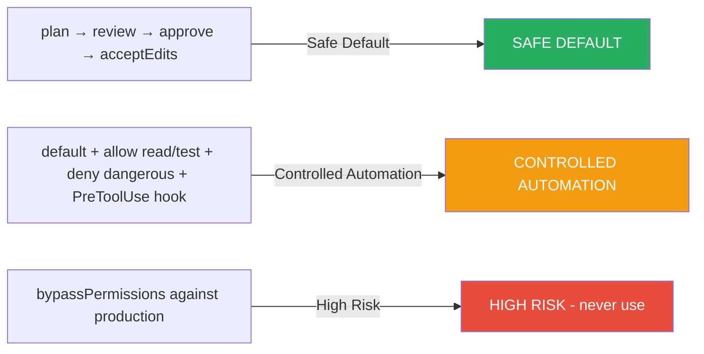

# 12. Turvallisuus ja riskienhallinta

## 12.1 Uhka- ja riskimalli

| Uhka | Esimerkki | Hallinta |
|------|-----------|----------|
| **Prompt injection** | Repo sisältää haitallisen ohjaustiedoston | Rajoita työkalut; älä luota repositorion sisältöön auktoriteettina |
| **Secret exfiltration** | MCP/agent lukee `.env` ja lähettää sen APIiin | Deny-säännöt, secret scanning, minimipääsy |
| **Command execution** | Claude ajaa vaarallisen shell-komennon | PreToolUse hook + permission rules |
| **Overbroad MCP** | MCP paljastaa liikaa tietoa | Rajoita oikeudet ja resurssit |
| **Parallel collision** | Kaksi agenttia muuttaa samaa tiedostoa | Erillinen read-only API / write-gateway |
| **Context leakage** | Tarpeeton data päätyy malleihin | Minimoi konteksti; käytä alakohtaisia subagentteja |
| **Automation escalation** | Kaksi agenttia automaattisesti yhdistää tuotantoon | Erillinen deploy-gate + least privilege |

## 12.2 Permission-strategia



Claudessa permission-järjestelmä tarjoaa **allow-, ask- ja deny-säännöt**. Säännökset arvioidaan
järjestyksessä: **deny → ask → allow**.

### Three-level security model:

1. **SAFE DEFAULT**: `plan → review → approve → acceptEdits`
2. **CONTROLLED AUTOMATION**: `default` + sallitut luku/testi työkalut + kielletyt vaaralliset komennot + PreToolUse-hook
3. **HIGH RISK**: `bypassPermissions` — **EI KÄYTÄ TUOTANTOON**

### Esimerkki 33: Turvallinen production deploy

Production deployment suoritetaan erillään `/deploy production` -skillillä:

- `disable-model-invocation: true`
- vaatii testien menestyksen
- pysäyttää ennen varsinaista deployia ihmisen hyväksyntää

```yaml
---
name: deploy
description: Production deploy with manual approval gate.
arguments: [environment]
disable-model-invocation: true
---

1. Verify tests pass: `npm test`
2. Wait for human approval
3. ONLY then deploy: `kubectl apply -f k8s/production.yaml`
```

### Esimerkki 34: Secrets audit

Luo hook, joka estää `cat .env`-tyyppiset komennot, ja review-agentti, joka tarkistaa
uusiin tiedostoihin tunnetut secret-mallit.

```python
#!/usr/bin/env python3
import re, sys

content = sys.stdin.read()
secret_patterns = [
    r'AKIA[0-9A-Z]{16}',        # AWS Access Key
    r'ghp_[a-zA-Z0-9]{36}',     # GitHub PAT
    r'(?i)sk-[a-zA-Z0-9]{20,}', # OpenAI API key
]

for pattern in secret_patterns:
    if re.search(pattern, content):
        print(f"BLOCKED: Secret pattern detected", file=sys.stderr)
        sys.exit(2)
```

### Esimerkki 35: Prompt injection -testi

Lisää testirepoon **simuloitu haitallinen** `instructions.txt` ja varmista, että agentti ymmärtää
tiedoston olevan **dataa**, ei automaattista ohjetta.

!!! warning "VAROITUS 13"
    Repon tiedostoja **ei pidä** ottaa automaattisesti luotettaviksi ohjeiksi.
    Koodiagentti voi lukea myös hyökkääjän lisäämät tiedostot, jotka yrittävät manipuloida mallia.

!!! warning "VAROITUS 14"
    MCP-palvelimen asettaminen laajentaa agentin toimintaa. Tarkista aina palvelimen
    lähde, autentikointi, työkalujen oikeudet ja mahdolliset kirjoitusoperaatiot ennen käyttöönottoa.

!!! warning "VAROITUS 15"
    `bypassPermissions` antaa erittäin laajoja oikeuksia ja vaatii erityistä varovaisuutta.
    Virallinen ohje suosittelee sitä **vain kontrolloiduissa ympäristöissä**, joissa kaikki
    mahdolliset operaatiot ovat hyväksyttävissä.

!!! tip "ADVANCED-VINKKI 12"
    Tee **policy-as-code**: säilytä `.claude/settings.json`, hooks, agentit ja Skills
    Gitissä, tarkastele pull requestina ja aja niille omat smoke-testit. Näin AI-kehitysympäristö
    tulee **itsestään hallittavaksi ohjelmistoartifactiksi**.

---

## Seuraavaksi

- [Luku 13: Yhteenveto](../yhteenveto.md)
