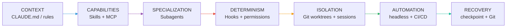

# 13. Yhteenveto

!!! quote "Keskeinen viesti"

    **Claude Code kannattaa nähdä ohjelmistokehityksen agenttialustana.**
    Yksittäinen prompti on vain käyttöliittymä tämän alustan ympärillä.
    Todellinen voima syntyy silloin, kun **context, Skills, subagents, hooks, MCP** ja
    **worktrees** muodostavat **hallitun tuotantokaavan**.

## Konteksti + ominaisuudet + erikoistuminen + determinismi + erottelu + automaatio + paluu = **Hallittu agenttikehitys**

| Taso | Mekanismi | Etu |
|------|-----------|-----|
| **Context** | CLAUDE.md / säännöt | Yhtenäinen projektikonteksti |
| **Capabilities** | Skills + MCP | Toistettavuus ja ulkoiset resurssit |
| **Specialization** | Subagents | Kontekstin ja oikeuksien erottelu |
| **Determinism** | Hooks + permission rules | Turva ja laatu |
| **Isolation** | Git worktrees + sessions | Rinnakkainen työskentely |
| **Automation** | headless + CI/CD | Tuotantoprosessi |
| **Recovery** | Checkpoint + Git | Paluu mahdollista tilaan |

---

## Mitä tämä opas ei ole?

Tämä ei ole:

- 🎥 Videon kopio (transkriptio on aloitus, ei lopetus)
- 📄 Yksinkertaistettuja ohjeita (kyse on hallitusta kehityksestä)
- 🔓 Vapaata pääsyä kaikkiin oikeuksiin (turvallisuusrajoitus on tärkeä osa)

Tämä **on**:

- ✅ Selkeä viitekehys kaikille mekanismeille
- ✅ Esimerkkien kirja (35 käytäntöä)
- ✅ Turvallisuusrepertuaari (uhkamalli + riskit)

## Mitä opit?

- **Claude Code** on agenttiympäristö, jossa kielimalli pystyy tekemään valtavan paljon.
- **Konteksti** on voimaa, mutta sitä on **pidettävä hallinnassa**.
- **Hooks** ja **permission rules** ovat **deterministisiä** — kielen ei tarvitse päättää.
- **Sub-agentit** ja **worktrees** mahdollistavat **erillisen yhteyden** ja **rinnakkaisen kehittämisen**.
- **Headless mode** avaa oven **CI/CD-integraatiolle**.
- **Checkpointit** eivät korvaa **Gitiä**.

---

## Kiitos!

!!! info "Palaute ja lisäversiot"
    Opas pohjautuu käyttäjän antamaan videoon ja viralliseen dokumentaatioon.
    **Tarkista aina oma versiosi** `claude --help`-komennolla, sillä Claude Code
    kehitty erittäin nopeasti.

*Lähde: [S1] käyttäjän antama videotranskriptio, [S2–S22] virallinen dokumentaatio*

[Takaisin alkuun](#){: .md-button .md-button--primary }
